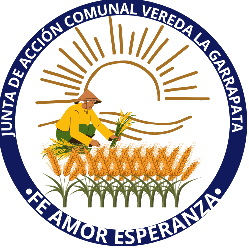

<!DOCTYPE html>
<html lang="es">
<head>
  <meta charset="UTF-8">
  <meta name="viewport" content="width=device-width, initial-scale=1.0">
  <title>Vereda La Garrapata | Gestión Comunitaria</title>
  <link rel="icon" type="image/png" href="imagenes/logo-jac-transparente.png">
  
</head>
<body>
  <a class="skip-link" href="#inicio">Saltar al contenido</a>
  <header>
    

      

        

          
        

        

          <strong>Vereda La Garrapata</strong>
          Organización Comunitaria
        

      

      <button class="menu-toggle" type="button" aria-expanded="false" aria-controls="mainNav">Menu</button>
      <nav id="mainNav" aria-label="Navegacion principal">
        <a class="nav-link" href="#inicio">Inicio</a>
        <a class="nav-link" href="#impacto">Impacto</a>
        <a class="nav-link" href="#servicios">Servicios</a>
        <a class="nav-link" href="institucional.html">Institucional</a>
        <a class="nav-link" href="#galeria">Galería</a>
        <a class="nav-link" href="#transparencia">Transparencia</a>
        <a class="nav-link" href="#ruta">Ruta</a>
        <a class="btn btn-primary" href="emitir-certificados.html">Emitir</a>
      </nav>
    

  </header>

  <main id="inicio" class="container">
    <section class="hero">
      

        Gestión comunitaria con trazabilidad
        <h1>Mostramos el trabajo de la vereda y formalizamos cada certificado</h1>
        

          Este home concentra el trabajo territorial de La Garrapata, visibiliza programas y conecta
          los módulos digitales para emisión y consulta de certificados de residencia.
        

        

          Documentos verificables
          Transparencia comunitaria
          Gestión con trazabilidad
        

        

          <a class="btn btn-primary" href="emitir-certificados.html">Ir a emitir certificados</a>
          <a class="btn btn-soft" href="consultar-certificados.html">Ir a consulta pública</a>
          <a class="btn btn-soft" href="institucional.html">Ver perfil institucional</a>
        

      

      <aside class="hero-panel">
        <h2>Tablero institucional</h2>
        <ul class="hero-list">
          <li>Seguimiento del trabajo social, productivo y ambiental en la vereda.</li>
          <li>Estándar para documentos oficiales con identidad local y código verificable.</li>
          <li>Transparencia de procesos comunitarios con trazabilidad de actas y acuerdos.</li>
          <li>Ruta digital para servicios de certificación y validación documental.</li>
        </ul>
        

          
<strong>126</strong>Familias

          
<strong>19</strong>Jornadas

          
<strong>8</strong>Programas

        

      </aside>
    </section>

    <section id="impacto" class="section">
      

        <h3>Impacto comunitario</h3>
        

          Indicadores de referencia para mostrar resultados y fortalecer confianza en la gestión social.
        

      

      

        <article class="metric">
          <strong>126</strong>
          Familias articuladas
          
Participación activa en juntas, mingas y actividades de organización barrial.

        </article>
        <article class="metric">
          <strong>19</strong>
          Jornadas colectivas
          
Trabajo colaborativo en vías, entorno escolar y gestión de espacios comunes.

        </article>
        <article class="metric">
          <strong>8</strong>
          Programas en curso
          
Líneas activas de ambiente, juventud, emprendimiento y apoyo comunitario.

        </article>
        <article class="metric">
          <strong>92%</strong>
          Actas digitalizadas
          
Respaldo documental para decisiones, acuerdos y seguimiento del plan veredal.

        </article>
      

    </section>

    <section id="servicios" class="section">
      

        <h3>Servicios del sistema</h3>
        

          Accesos operativos para la gestión documental de la vereda. Cada módulo responde a una tarea concreta.
        

      

      

        <article class="service reveal">
          Módulo activo
          <h4>Emisión de certificados</h4>
          

            Registro de residente, generación de consecutivo, código de verificación y formato listo para imprimir.
          

          <a class="btn btn-primary" href="emitir-certificados.html">Entrar al módulo</a>
        </article>
        <article class="service reveal">
          Módulo activo
          <h4>Consulta pública</h4>
          

            Validación de autenticidad por código para confirmar estado y datos principales del certificado emitido.
          

          <a class="btn btn-soft" href="consultar-certificados.html">Ir a consulta</a>
        </article>
        <article class="service reveal">
          Siguiente mejora
          <h4>Reportes de gestión</h4>
          

            Consolidado mensual de certificados emitidos y avance de actividades para presentaciones institucionales.
          

          <a class="btn btn-soft" href="#ruta">Ver ruta</a>
        </article>
      

    </section>

    <section id="proyectos" class="section">
      

        <h3>Trabajo comunitario en marcha</h3>
        

          Frentes activos que muestran resultados en convivencia, desarrollo local y cuidado del territorio.
        

      

      

        <article class="project reveal">
          Infraestructura
          <h4>Mejoramiento de vías rurales</h4>
          

            Mantenimiento por tramos críticos para movilidad de estudiantes, productores y transporte veredal,
            con apoyo de jornadas comunitarias.
          

        </article>
        <article class="project reveal">
          Agua y saneamiento
          <h4>Fortalecimiento del acueducto</h4>
          

            Limpieza de líneas, control de puntos de riesgo y esquema de turnos para cuidado preventivo del servicio.
          

        </article>
        <article class="project reveal">
          Educación y familia
          <h4>Acompañamiento escolar comunitario</h4>
          

            Refuerzo académico y red de apoyo para estudiantes con articulación entre padres y líderes locales.
          

        </article>
        <article class="project reveal">
          Ambiente
          <h4>Jornadas de limpieza y reforestación</h4>
          

            Recuperación de zonas comunes y protección de nacederos con grupos de voluntariado juvenil.
          

        </article>
      

    </section>

    <section id="galeria" class="section">
      

        <h3>Galería Comunitaria</h3>
        

          Registros fotográficos recientes de actividades y espacios de la vereda La Garrapata.
        

      

      

        <figure class="gallery-item reveal">
          
          <figcaption>Jornada comunitaria en territorio.</figcaption>
        </figure>
        <figure class="gallery-item reveal">
          
          <figcaption>Encuentro y participación de la comunidad.</figcaption>
        </figure>
        <figure class="gallery-item reveal">
          
          <figcaption>Proceso organizativo en actividades locales.</figcaption>
        </figure>
        <figure class="gallery-item reveal">
          
          <figcaption>Trabajo colaborativo para la vereda.</figcaption>
        </figure>
        <figure class="gallery-item reveal">
          
          <figcaption>Actividad comunitaria y fortalecimiento local.</figcaption>
        </figure>
      

    </section>

    <section id="transparencia" class="section">
      

        <h3>Transparencia y documentos</h3>
        

          Espacio para publicar los documentos de control comunitario y garantizar acceso a información relevante.
        

      

      

        <article class="doc-card reveal">
          <strong>Control institucional</strong>
          <h4>Actas de asambleas</h4>
          
Repositorio de actas aprobadas y compromisos acordados por la comunidad.

          <a href="#">Abrir carpeta de actas</a>
        </article>
        <article class="doc-card reveal">
          <strong>Gestión documental</strong>
          <h4>Formato de certificaciones</h4>
          
Modelo oficial del certificado de residencia con datos del firmante autorizado.

          <a href="emitir-certificados.html">Ir al formato digital</a>
        </article>
        <article class="doc-card reveal">
          <strong>Rendición social</strong>
          <h4>Informe de avances</h4>
          
Resumen de metas, actividades y estado de proyectos comunitarios por periodo.

          <a href="#">Ver informe de gestión</a>
        </article>
      

    </section>

    <section class="section">
      

        <h3>Agenda y equipo comunitario</h3>
        

          Planeación operativa y responsables de liderazgo para sostener los procesos de la vereda.
        

      

      

        <article class="agenda reveal">
          <h4>Agenda de próximas actividades</h4>
          <ul class="agenda-list">
            <li>
              <strong>Asamblea general de seguimiento</strong>
              Sábado 14 - 9:00 am
              Salón comunal, verificación de compromisos y nuevos acuerdos.
            </li>
            <li>
              <strong>Jornada de mantenimiento vial</strong>
              Domingo 22 - 7:30 am
              Intervención en dos tramos priorizados por movilidad escolar.
            </li>
            <li>
              <strong>Capacitación documental</strong>
              Miércoles 25 - 5:00 pm
              Uso del sistema de certificados y buenas prácticas de archivo.
            </li>
          </ul>
        </article>
        <article class="team reveal">
          <h4>Equipo comunitario de referencia</h4>
          

            

              <strong>María Elena Pérez</strong>
              Presidencia Junta Veredal
              
Coordina asambleas, firma certificaciones y seguimiento de compromisos comunitarios.

            

            

              <strong>Carlos Alberto Rojas</strong>
              Comité de infraestructura
              
Articula jornadas de mejora vial y control de mantenimientos preventivos.

            

            

              <strong>Luisa Fernanda Torres</strong>
              Comité social y educativo
              
Gestiona apoyo a familias, actividades juveniles y acompañamiento escolar.

            

            

              <strong>Jorge Andrés Molina</strong>
              Gestor documental
              
Consolida actas, archivos de respaldo y apoyo técnico del sistema digital.

            

          

        </article>
      

    </section>

    <section id="ruta" class="section">
      

        <h3>Ruta digital del sistema</h3>
        

          Hoja de ruta para consolidar la plataforma de certificados y mejorar trazabilidad institucional.
        

      

      <ul class="roadmap">
        <li class="reveal"><strong>Fase 1:</strong> Home institucional para mostrar trabajo comunitario y objetivos.</li>
        <li class="reveal"><strong>Fase 2:</strong> Módulo de emisión con consecutivo y formato de impresión.</li>
        <li class="reveal"><strong>Fase 3:</strong> Módulo público de consulta por código de verificación.</li>
        <li class="reveal"><strong>Fase 4:</strong> Reportes mensuales para rendición y seguimiento de gestión.</li>
      </ul>
    </section>

    <section class="cta">
      

        <h4>Operación documental lista para la comunidad</h4>
        

          Continúa con la emisión de certificados o valida documentos ya emitidos desde la consulta pública.
        

      

      

        <a class="btn btn-soft" href="consultar-certificados.html">Consultar</a>
        <a class="btn btn-outline" href="emitir-certificados.html">Emitir certificado</a>
      

    </section>

    <footer>
      Organización Comunitaria Vereda La Garrapata | Plataforma de gestión y certificados
      
    </footer>
  </main>

  
</body>
</html>

